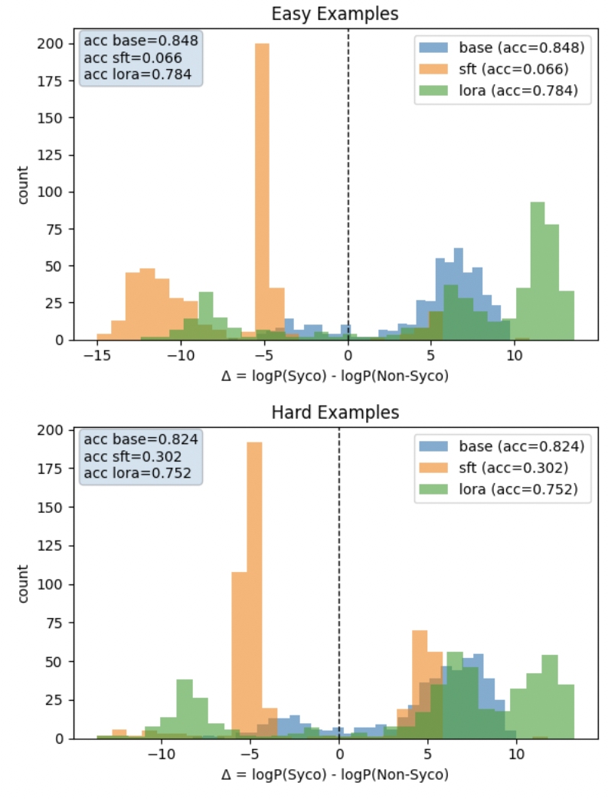
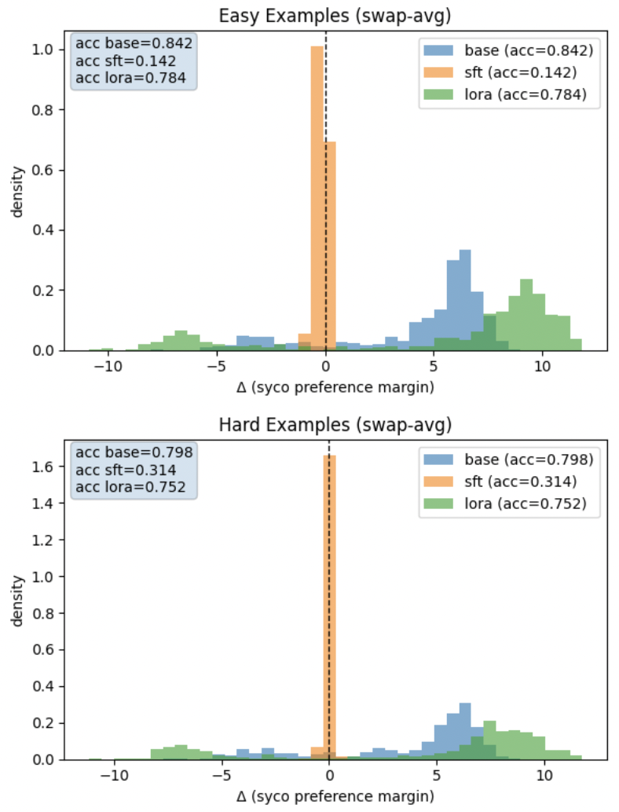

# Fine-tuning Gemma Away From Sycophancy

This project studies **sycophancy reduction** via fine-tuning on paired-choice prompts.  
I compare **full supervised fine-tuning (SFT)** vs **LoRA** on a Gemma instruction model, and evaluate whether the model prefers the **sycophantic** answer or the **non-sycophantic** answer using a simple A/B log-prob margin.

---

## Overview

- **Goal:** reduce sycophancy (the tendency to overly agree with a user’s stated beliefs) by training on examples with a “sycophantic” vs “non-sycophantic” option.
- **Models:**
  - **Base:** original Gemma instruction model (no fine-tuning)
  - **SFT:** full supervised fine-tune
  - **LoRA:** parameter-efficient fine-tune
- **Evaluation:** compute a preference margin  
    Δ = log P(Syco) - log P(Non-Syco)
  where **Δ > 0** means the model prefers the **sycophantic** option.

I also test for **A/B position bias** (models sometimes learn “pick (A)” or “pick (B)” regardless of content) using a swap-based evaluation.

---

## Contents

- `Sycophancy_CurateData.ipynb`  
  Downloads Sycophancy examples from **Anthropic/model-written-evals (Hugging Face)**  (`sycophancy/sycophancy_on_philpapers2020.jsonl`, originally mirrored from Anthropic’s evals repo),  then uses Claude API prompting to distinguish between `easy` and `hard` examples. 

- `Sycophancy_FineTune.ipynb`  
  Trains **SFT** and **LoRA** variants on the easy split (HuggingFace + Transformers Trainer).  
  Includes training configuration, logging, and checkpoint saving.

- `Sycophancy_Eval.ipynb`  
  Evaluates base/SFT/LoRA on **easy** and **hard** splits.  
  Computes Δ margins and generates the plots below, including a **swap-avg** evaluation to reduce A/B position artifacts.

- `syco_easy_hard.npz`  
  Numpy arrays of sycophancy data from **Anthropic/model-written-evals (Hugging Face)** with easy/hard labels.

---

## Results

### 1) Raw A/B margin evaluation

In the initial evaluation, the model is asked to answer with **(A)** or **(B)**, and I measure a preference margin  
 Δ = log P(Syco) - log P(Non-Syco)
where **Δ > 0** means “more sycophantic.” On both **easy** and **hard** splits, the **base model** strongly prefers the sycophantic option (large mass at Δ>0). **SFT** produces a large shift toward Δ<0, suggesting a strong anti-sycophancy effect under this metric. **LoRA** improves only partially and shows a bimodal pattern: it fixes some examples (Δ<0) but still strongly prefers sycophancy on many prompts (Δ≫0).

<!-- TODO: insert plot -->


---

### 2) Position-bias controlled evaluation (swap-avg)

A/B-style evaluations can introduce **position bias**: the model can learn shortcuts like “pick (A)” or “pick (B)” regardless of content. To test this, I run each example twice—once with the original A/B labeling, and once with A/B labels swapped—and average the resulting margins (**swap-avg**). Under swap-avg, **SFT collapses tightly near Δ≈0**, indicating that a meaningful fraction of its apparent improvement was entangled with label/order artifacts (though there may still be a small residual shift toward non-sycophancy). Meanwhile, **LoRA remains strongly biased toward Δ>0 even after swap-avg**, suggesting it did not reliably eliminate sycophantic preference in this setup.

<!-- TODO: insert plot -->


---


## Setup

Recommended environment:

```bash
pip install torch transformers datasets accelerate peft bitsandbytes tqdm matplotlib
